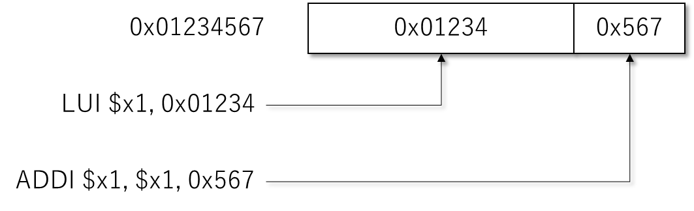

# 正誤表

- P.33 「メモリストア命令」
  - 誤: 「それぞれ32ビット、8ビット、16ビットのデータを読み出す例です」
  - 正: 「それぞれ32ビット、8ビット、16ビットのデータをメモリに書き込む例です」

- P.51の図に関して (詳細は [#26](https://github.com/msyksphinz-self/support_ca_llvm_book/issues/26) を参照ください)
  - https://msyksphinz.hatenablog.com/entry/2020/06/19/040000 を引用しています。
  - long doubleがARMが64bit, x86が80bitと、それぞれnativeでsupportしているformatであるのに対して、RISC-V ABIではISAがsupportしていない 128bitの formatを指定していることがポイントです。

- P.64 2段落目
  - 誤: Machine Execption Program Counter
  - 正: Machine Exception Program Counter

- P.68 2段落目
  - 誤: Calle Saved
  - 正: Callee Saved

- P.71 のRISC-V GNUツールチェインのインストールに関して
  - P.381のサンプルを試すためには、riscv64-unknown-linux-gnuツールチェイン(Linuxホスト用のGCCツールチェイン)が必要となります。
  - riscv64-unknown-linux-gnuツールチェインについては、https://github.com/riscv-collab/riscv-gnu-toolchain#installation-linux に従ってビルドしてください。
  - また、毎度ツールチェインのビルドには時間がかかりますので、以下のリリースタグからビルド済みのバイナリをダウンロードできます。
  - 例 2022.08.26ビルド済みのバイナリダウンロード: https://github.com/riscv-collab/riscv-gnu-toolchain/releases/tag/2022.08.26

- P.71 riscv-toolsのビルド (https://github.com/msyksphinz-self/support_ca_llvm_book/issues/6)
  - 本書の確認した環境以外で、riscv-toolsがビルドに失敗することがあります。
  - riscv-toolsリポジトリ自体が古くなっており、個別にツール群をビルドする必要があります。
  - riscv-toolsからsubmoduleでリンクされているツールセットはdeprecatedされているようであり、各ツール群を個別にダウンロードしてビルドする必要があるようです。
    - riscv-isa-sim : https://github.com/riscv-software-src/riscv-isa-sim
    - riscv-tests : https://github.com/riscv-software-src/riscv-tests
    - riscv-pk : https://github.com/riscv-software-src/riscv-pk

- P.71
  - 誤: 「完了たら」
  - 正: 「完了したら」
- P.75 `0x101de`
  - 誤: `MV a5, a1`
  - 正: `MV a0, a5`


- P.82 コマンド内:

  - 誤: `  -fno-builtin-printf -nostdlib -nostartfiles -lm -lgcc -T link.ld \`
  - 正: `  -fno-builtin-printf -nostdlib -nostartfiles -lm -lgcc -T test.ld \`

- P.91 LLVM IR (コード内関数名)
  - 誤: `@add1`
  - 正: `@add`

- P.102-P.103

  - LLVMビルド+アセンブリ生成がうまく行かない。

  - Issue: https://github.com/msyksphinz-self/support_ca_llvm_book/issues/1

  - ビルドオプションの変更が必要です。 https://github.com/msyksphinz-self/support_ca_llvm_book/issues/1 を参照ください。具体的には、以下のコマンドフローとなります。

    ```sh
    $ ${BUILD}/bin/clang-12 riscv_test.c -emit-llvm -c --target=riscv64-unknown-elf
    $ ${BUILD/build/bin/llc riscv_test.bc -march=riscv64 --float-abi=hard -mattr="+d,+f" -filetype=asm
    $ riscv64-unknown-elf-gcc riscv_test.s -march=rv64gc -lc -o riscv_test
    ```

  - これでも解決しない場合、`clang`のオプションに`--sysroot=`を追加して試行してください(https://github.com/msyksphinz-self/support_ca_llvm_book/issues/1#issuecomment-1186797222 にてご指摘いただきました。ありがとうございます)。

    ```sh
    $ ${BUILD}/bin/clang -emit-llvm -c riscv_test.c --target=riscv64-unknown-linux-gnu --sysroot=${HOME}/riscv64_github/sysroot
    $ ${BUILD}/bin/llc riscv_test.bc -march=riscv64 -mattr="+d,+f" -filetype=asm
    $ riscv64-unknown-linux-gnu-gcc riscv_test.s -lc -static -o riscv_test
    $ spike pk riscv_test
    ```

- P.127 3段落目
  - 誤: `SubtargetFeature`のに与えている
  - 正: `SubtargetFeature`に与えている

- P.141 `MYRISCVXCallingConv.td`コード内
  - 誤: Calee Saved
  - 正: Callee Saved

- P.147

  - データアライメントの説明において、`iA:B`という説明のみを行っていますが、直後のソースコードで`iA:B:C`という表記を用いている
  - `iA:B:C`の場合、Bのサイズでアライメントするが、Cのサイズでアライメントすることが好ましい、という意味になる

- P.152 `MYRISCVXCallingConv.td`コード内

  - 誤: Calee Saved
  - 正: Callee Saved

- P.185 リスト内
  - 誤: `LowerRetrun()`
  - 正: `LowerReturn()`

- P.194 コマンド内の`-c`が抜けています
  - 誤: `$ ${BUILD}/bin/clang -target riscv32-unknown-elf simple_func.c -emit-llvm -o simple_func.bc`
  - 正: `$ ${BUILD}/bin/clang -target riscv32-unknown-elf simple_func.c -c -emit-llvm -o simple_func.bc`

- P.195

  - 誤: `simple_test.ll`というファイルを作成します
  - 正: `simple_func.ll`というファイルを作成します
  - 誤: ソースコードのパス`llvm/test/CodeGen/MYRISCVX/simple_test.ll`
  - 正: ソースコードのパス`llvm/test/CodeGen/MYRISCVX/simple_func.ll`

- P.201 図16に誤りが含まれています


  - 

- P.202


  - 0x12345defの生成の生成フローとなっているが、図17に準ずると0x01234defの生成が正しい

- P.210 / P.213

  - ソースコード・コマンド内のファイル名表記にぶれがあります

  - 誤: `constant2.*`

  - 正: `constants2.*`

- P.235 4段落目
  - 誤: MahineInstr
  - 正: MachineInstr

- P.260 論理和命令
  - 誤: `ORI rd, rd2, imm`
  - 正: `ORI rd, rd1, imm`

- P.263 最終段落
  - 誤: だけだ異なります
  - 正: だけが異なります

- P.265 3段落目
  - 誤: 作業としてはの
  - 正: 作業としては

- P.274 ビルドコマンド内
  - 誤: 「ソースコードを見やすくするため」
  - 正: 「生成されたアセンブリ命令を見やすくするため」

- P.287 2段落目
  - 誤: `rotate_lef()`
  - 正: `rotate_left()`

- P.325

  - 誤: `R_MYRISCVX_LO12_I` / `R_MYRISCVX_LO12_`S / `R_MYRISCVX_PCREL_LO12_I` / `R_MYRISCVX_PCREL_LO12_S` の説明欄がすべて「上位12ビット」となっている
  - 正: 「下位12ビット」
  - 誤: `R_MYRISCVX_PCREL_LO12_I`と`R_MYRISCVX_PCREL_LO12_S`の説明欄が「絶対アドレスの上位12ビット」となっている
  - 正: 「PC相対アドレスの下位12ビット」

- P.333

  - 誤: `static`ポリシかつ`medlow`コードモデルの際、LLVMで出力したものをgccの結果と比較する際に`objdump`したコードが、`static`ポリシかつ`medany`のものになっています。

    - `auipc`命令などが使用されていますが、これは`medany`コードモデルのものです。

  - 正しくは以下のようになります。

  - ```
    0000000000000000 <update_global>:
       0:   00000537                lui     a0,0x0
                            0: R_RISCV_HI20 global_val
                            0: R_RISCV_RELAX        *ABS*
       4:   00050513                mv      a0,a0
                            4: R_RISCV_LO12_I       global_val
                            4: R_RISCV_RELAX        *ABS*
       8:   00052583                lw      a1,0(a0) # 0 <update_global>
       c:   00158593                addi    a1,a1,1
      10:   00b52023                sw      a1,0(a0)
      14:   00008067                ret
    ```

- P.336 ２つ目のプログラム例
  - 誤: 20番目の要素のアドレスを示す
  - 正: 10番目の要素のアドレスを示す
  - 誤: `&array_char[20]`
  - 正: `&array_char[10]`

- P.353 switch文
  - 誤: `/* default 選択文`
  - 正: `/* default 選択文 */`

- P.358 1つ目のアセンブリ表現
  - 誤: `EXp1 == x0をFinishの条件にしているが`
  - 正: `Cond == x0をFinishの条件にしているが`

- P.388 図44
  - 誤: `func_calee`
  - 正: `func_callee`

- P.393 1段落目
  - 誤: `TargetLowerig::LowerCall()`
  - 正: `TargetLowering::LowerCall()`

- P.404 ソースコード内
  - 誤: `// loaImmediate()を呼び出して`
  - 正: `// loadImmediate()を呼び出して`

- P.404 ２段落目
  - 誤: 完了れば
  - 正: 完了すれば

- P.421 表8
  - 誤: `BOOm : MediumBoomConfig`
  - 正: `BOOM : MediumBoomConfig`

- P.427 図3
  - 誤: ELP Header
  - 正: ELF Header

- P.478 2段落目
  - 誤: まずは`MYRISCVXAsmparser::parseRegister()`を見てみます
  - 正: まずは`MYRISCVXAsmParser::parseRegister()`を見てみます

- P.480 2段落目
  - 誤: `ParseImmediate()`
  - 正: `parseImmediate()`
  - 誤: `ParseRegister()`
  - 正: `parseRegister()`

- P.481 3段落目
  - 誤: `ParseMemOperand()`
  - 正: `parseMemOperand()`
  - 誤: `ParseImmediate()`
  - 正: `parseImmediate()`

- P.488 `MYRISCVXAsmParser.cpp`
  - 誤: `// -2048 から 2048までの`
  - 正: `// -2048 から 2047までの`

- P.489 リスト内
  - 誤: 2028の場合
  - 正: 2048の場合

- P.495 2段落目
    - 誤: 見つけると、、
    - 正: 見つけると、

- P.500 1段落目
    - 誤: 発想としては単純ですがN-Queen問題の解放としては
    - 正: 発想としては単純ですがN-Queen問題の解法としては

- P.501 1段落目
    - 誤: マスが０でない場所を探しクイーンを配置し
    - 正: マスの値が０である場所を探しクイーンを配置し

- P.513

  - 誤: ソースコードのパス`llvm-myriscvx120/test/CodeGen/RISCV`
  - 正: ソースコードのパス`llvm-myriscvx120/llvm/test/CodeGen/RISCV`
